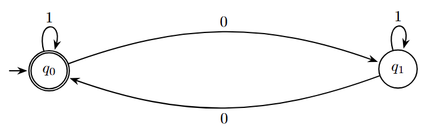

# Interactive Environment for Designing and Simulating Deterministic Finite Automata

The goal of the project is to simulate the operation of a finite automaton on a given input word with the ability to trace the computation process.

## Definition

A Deterministic Finite Automaton (**DFA**) is a structure defined as:

$$M = (Q, \Sigma, \delta, q_0, F)$$

where:

- $Q$ - a finite set of states ($Q = \{q_0, q_1, ..., q_n\}$),
- $\Sigma$ - a finite input alphabet,
- $q_0$ - the initial state ($q_0 \in Q$),
- $F$ - a set of accepting states,
- $\delta$ - the transition function ($\delta: Q \times \Sigma \to Q$).

A DFA computation involves executing successive moves defined by the values of the transition function $\delta$. Based on the symbol $x$ read by the tape head and the state $p$ in which the control currently resides, the following occurs:

- transition of control to a certain state $q \in Q$,
- movement of the head one cell to the right.

The DFA will execute successive moves until all input symbols are read. Then, the computation stops. The automaton accepts the input data if and only if the automaton terminates the computation in an accepting state (belonging to $F$).

**Note:** We assume that if the automaton encounters a letter of the alphabet in a given state for which there is no transition ($\delta$ is not a total function), the automaton rejects such a word.

### Example

  

The figure shows a simple automaton accepting the language $L$ over the alphabet $\Sigma = {0, 1}$, consisting of binary strings with an even number of zeros. The automaton will accept the word 100, while it will reject the word 10100.

More theoretical information can be found in the book _"Automata Theory and Formal Languages"_, chapter 7 _"Finite automata"_, Władysław Homenda, Witod Pedrycz, or in online sources.

## Application Description

The application consists of two parts:

1. **Lab:** An automaton editor, which allows for creating an automaton as well as exporting/importing it from a file.
2. **Home:** A runtime environment, which allows importing an automaton from a file and simulating calculations on a given input word.

### Runtime environment - project assignment

The functionalities described in the laboratory part must be extended with the following elements:
- **State:** (2p)
  - Each state has additional attributes in the form of:
    - fill color,
    - edge color,
    - radius,
    - edge thickness.
  - The UI allows modifying attributes for the active state via _Data Binding_ and dedicated controls (_color picker_, _slider_, _input_, etc.).
- **Transitions:** (1p)
  - Each transition has a label in the form of: `a,b,c`, where $a, b, c \in \sigma$.
  - While adding a transition between states, it is possible to specify a label.
  - Each transition has a marked end (see [Example](#example)).
  - If transitions exist between $q_i$ and $q_j$ in both directions, these transitions do not overlap on the canvas.
  - A transition can lead to the same state (see [Example](#example)).
  - The UI displays the current alphabet, which is a set of unique symbols extracted from all transition labels.
- **Deleting a transition:** (1p)
  - It is possible to activate a transition (analogously to activating a state).
  - The user can delete the active transition.
- **Import from file:** (1p)
  - The user can import an automaton from a JSON file using the `Import` button or the menu bar at the top of the application screen.
  - The file format should comply with the example [automaton.json](./automaton.json) file.
  - The file selection dialog should open by default in the folder with the prepared example automata.
  - The content of the imported file should be validated. In case of invalid data in the file, an appropriate error message should be displayed.
- **Export to file:** (1p)
  - The user can export a valid automaton to a JSON file, compliant with the example [automaton.json](./automaton.json) file.
  - The user can export the automaton as an image (any format: JPEG/PNG or other).

The **Runtime environment** should have the following functionalities:
- **Entering an input word:** (1p)
  - The user can enter the input word before starting the computations.
  - The input word is validated (it should contain only letters from the $\Sigma$ alphabet for the currently loaded automaton).
  - During computations, the currently processed letter of the word is highlighted.
  - It is not possible to edit the input word during computations.
- **Step-by-step mode:** (2p)
  - `Next` and `Previous` buttons are available, which cause the control to advance/return to the next/previous $q \in Q$ state.
  - The buttons should be disabled depending on the currently processed letter of the word (the `Previous` button is disabled on the first letter, and `Next` on the last one).
  - The state currently holding the control is highlighted.
  - The active transition and label symbol should be highlighted.
  - After computations finish, the user receives feedback on whether the word was accepted or rejected.
- **Animation mode:** (2p)
  - `Start`, `Stop`, and `Reset` buttons are available, which respectively start the computations, stop them, and return to the initial state (control returns to state $q_0$, the processed letter is the first in the word).
  - The buttons should be disabled depending on the current application state (e.g., before loading the automaton all should be disabled, during the simulation `Start` should be disabled, etc.).
  - The animation speed can be controlled (slider).
- **State history:** (1p)
  - The UI displays the computation history for a given word in the form of a list/table (each list element is a pair consisting of a state and the processed letter).
  - Loading a new automaton or changing the input word should reset the list state.
  - Pressing the `Next` button adds an element to the list/table, whereas pressing `Previous` removes the last element.

### Sample Inspirations

Example existing applications that can serve as inspiration for better understanding the instructions/user interface operation:
- [AutomataDraw](https://www.automadraw.com/fsm),
- [FSM Builder](https://fsm-builder.vercel.app/),
- [Automata Lab](https://www.automataaa.com).